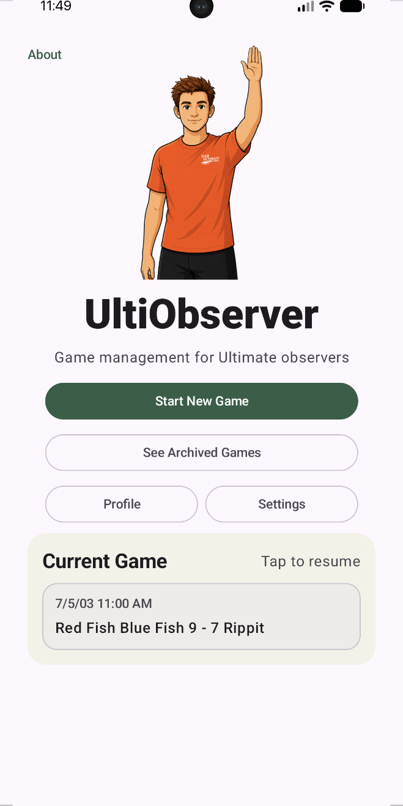
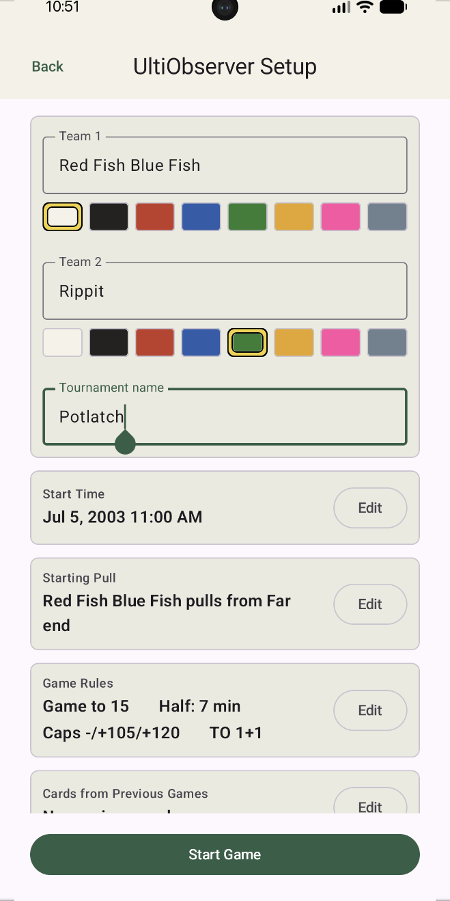
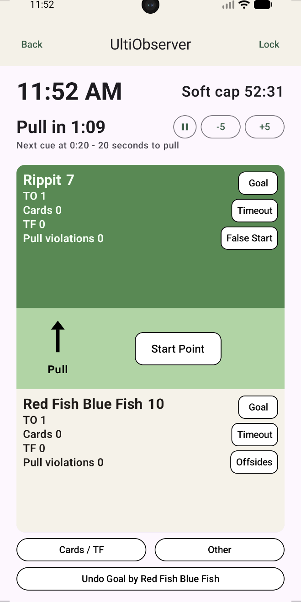
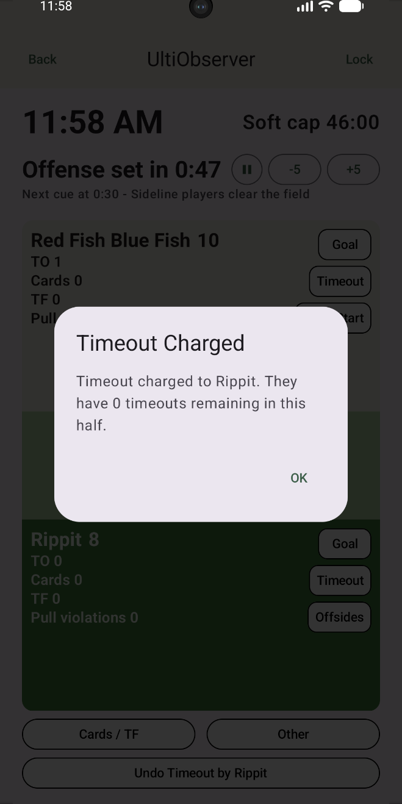
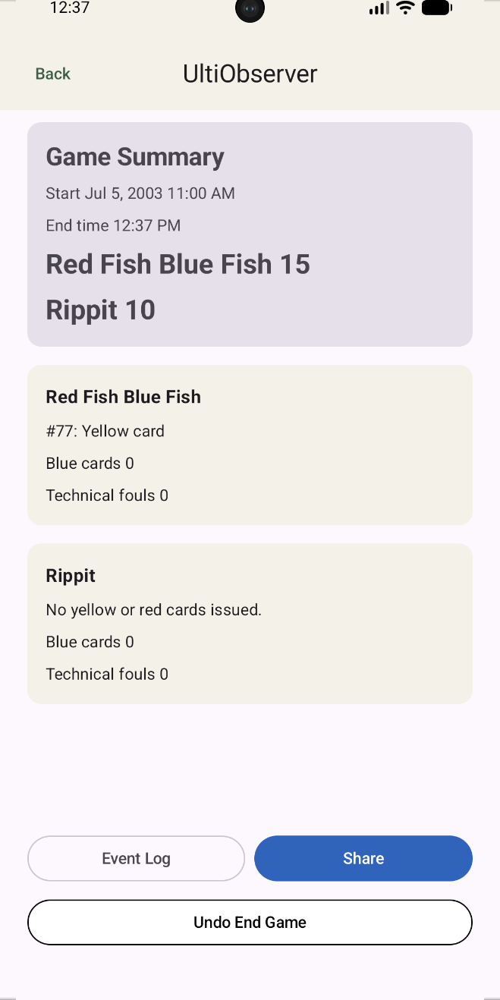

UltiObserver
============

UltiObserver is an Android (so far) app to help Ultimate Observers manage the
time, score, cards, and other items that need to be recorded.
It is intended to take the place of both the paper score sheets we typically
use to keep track of things and the stopwatch for keeping time.

Installation
------------

For now, UltiObserver is available as an Android APK from the
[GitHub releases page](https://github.com/rmjarvis/ultiobserver/releases).
Eventually I plan to put it on the Google Play Store as well, but the APK is the
first way I am making it available for testing.

To install the APK, download it on your Android device and open it. Android will
probably warn you that the app is from an unknown source, since it did not come
through the Play Store. You will need to allow installation from your browser or
file manager to continue.

Screenshots
-----------

  
  
  

  
  

Current features
----------------

* It keeps track of which team is pulling and from which end. The live game screen shows
the field orientation as seen from one end of the field. This would normally be the
endzone where you have primary responsibility as an observer.

* It keeps track of the time remaining for observing cues you are responsible for.
E.g. if the team at your endzone is receiving, it will give cues for 20 and 10 seconds
until they need to signal readiness. Similar for the pull time if the team at
your endzone is pulling.

* For timeouts, it will similarly keep track of the time and tell you when to
announce sideline clear, 20 to set, etc.

* You can customize which (if any) timing cues you want to have associated sounds and/or
haptic feedback. With sounds, you probably want to use ear buds, of course...

* It keeps track of misconduct cards for players and teams, including players entering the
game with previous cards during that tournament. It will give you a message reminding
you of the appropriate misconduct penalty, including tournament suspensions if a player
exceeds three yellows in the tournament for instance. Same for technical fouls.

* It records offsides, false starts, and time violations, and it lets you know what the
appropriate starting position is in each case.

* It tells you when a relevant cap (half, soft, or hard) is coming up, and you can configure
it to make a sound or vibrate when the cap goes off in case your tournament doesn't have a horn
(or it's too far away to hear clearly).

* During live points, the screen automatically locks (by default) to avoid errant button
presses if you put your phone in your pocket. You can also manually lock it at any time.

* All actions are undo-able. And even redo-able if you didn't mean to click undo.

* The current rule set is based on USAU games to points. It doesn't yet work well on timed
games (e.g. PUL and WUL games). That's on my to-do list.

* It keeps a full event log with timestamps in case you need to go back to see when something
happened.

* You can manually override just about everything during the game in case there is some
weird situation you need to fix. Like maybe you listed the wrong person for a card and
need to fix it. Or the tournament director decides to allow an extra floater timeout because
it's so hot, so you need to change the timeout rules.

* At the end of a game, the game summary can be easily shared with the tournament director
or head observer via text or group me or whatever they prefer you to use.

* Completed games are archived for later viewing or sharing. You can even restore a
game that has been archived back into a live state. However, the undo history is not
preserved when archiving, so a restored game cannot undo actions from before it was archived.

Android Support
---------------

UltiObserver is currently Android only. It is designed for portrait mode, since
that matches the normal live-game field layout with your end of the field at the
bottom of the screen.

I expect it to work on reasonably current Android phones. If you run into problems
on an older phone or an unusual screen size, please open an issue with the phone
model and Android version.

Privacy
-------

UltiObserver does not have ads, analytics, or in-app purchases. It does not send
your game data to me or to any server I run.

The app stores your profile, settings, current game, and archived games locally on
your device. Android may include this app data in its normal device backup system,
depending on your phone and Google account backup settings.

If you share a game summary, that uses Android's normal share sheet, so the data
goes only to the app or person you choose.

Payments
--------

* The app will always be free to download and free to use.

* There are no in-app purchases, ads, or any other charges.

* If you like the app and feel like throwing a little coin at me, I accept donations via
Venmo at @Mike-Jarvis-6. Confirmation 4058.

Planned Improvements
--------------------

* Add a timed-game mode. Specifically targeting PUL and WUL games, but in general making it work
for games to time. Either quarters or halves.

* Add alternate countdown rules. Again targeting the shorter times in PUL and WUL games, but
right now the countdowns are all fixed at USAU times.

* Add a landscape mode. I think most of the time the portrait mode with the near end of the field
at the bottom will be intuitive. But I'd like to add the option for a landscape mode where the
two ends of the field are left and right instead.

* Add some organization options in the Archived Games screen. Right now all previous games are
listed in order. But it would be nice to be able to view just the games you did from a
particular tournament for instance. Or maybe just today's games. Some organizational options
there would probably be useful.

* I'm not sure if this is feasible, but it might be possible to let the app serve as a
walkie talkie between you and the other observer(s) doing the game. Everyone could have their
own preferred ear buds in and talk to each other via the app, rather than the often
uncomfortable radio headsets that we sometimes use.

Reporting Issues
----------------

The source code is hosted at <https://github.com/rmjarvis/ultiobserver>.
Please let me know about any bugs you discover, rule mistakes, confusing observer workflows,
crashes, or places where the UI is awkward during actual field use.
If you find anything like that or if you want to request feature additions,
please go to the [GitHub Issues page](https://github.com/rmjarvis/ultiobserver/issues)
and add an issue describing your request.

License
-------

UltiObserver is licensed under the MIT license (see LICENSE file in this repo).
Basically, this means you can freely use it, distribute it, modify it, and even
sell it if you can find someone willing to pay for it when I give it away for free.
You just need to keep my copyright notice with the software when you do so.
