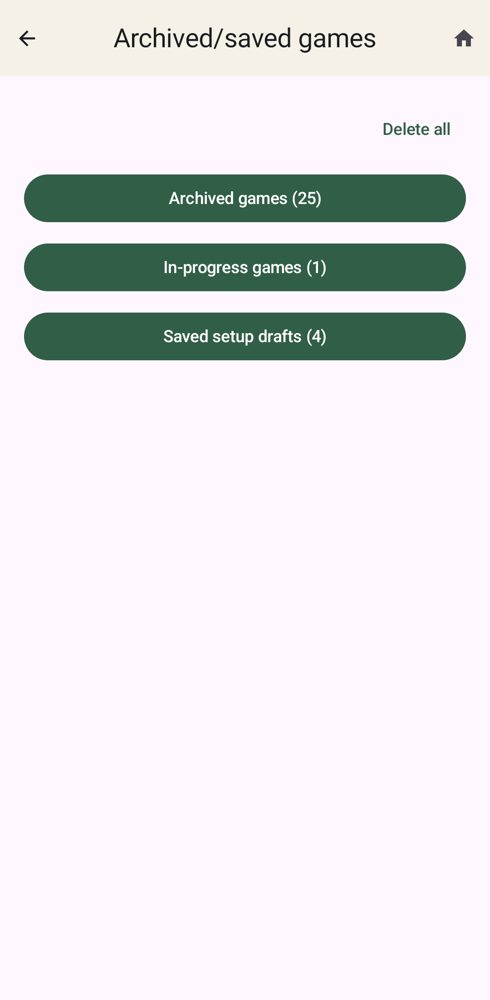
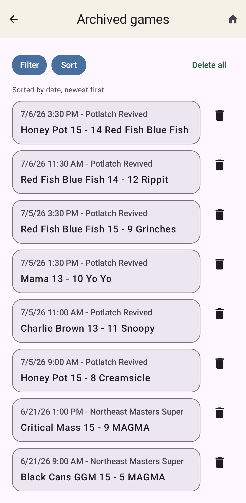
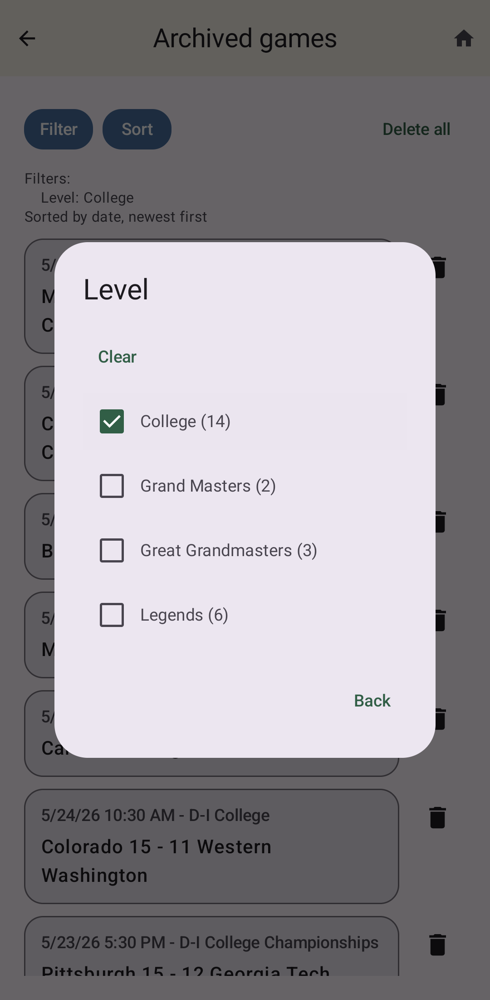
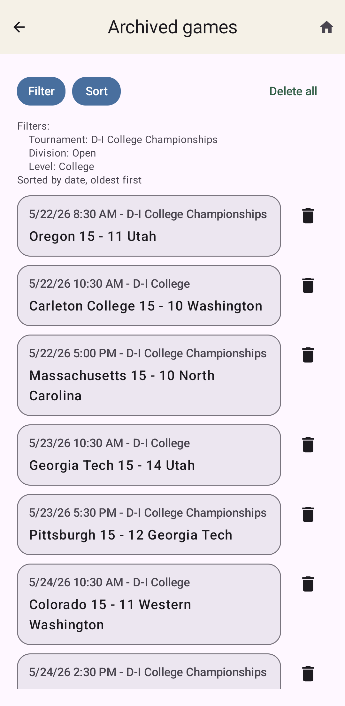
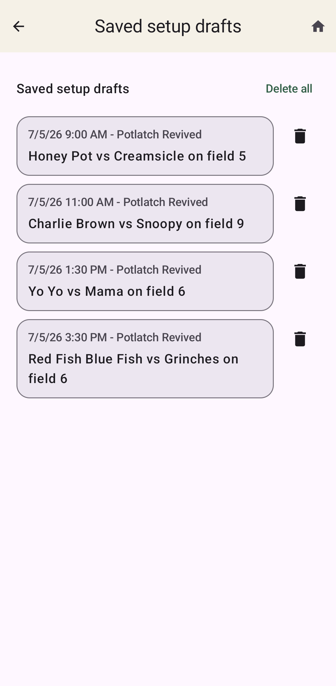

Saved And Archived Games
========================

      setup drafts

UltiObserver keeps track of past games so you can reference them later, including sharing
summary information after the fact. (See :ref:`Share`.)
It also saves setup drafts and in-progress games that might have accidentally been
bumped from the current game spot. All of these games are available from the
home button **See archived/saved games**. That takes you to a page with three menu options.

Archived games
--------------

Completed games end up here. You can manually archive a completed game from the
:ref:`Game Summary` page that shows up after a game is over. You can also archive a
completed current game from the home page. It will also be automatically archived
if you start a new game when the existing current game is completed.

The Archived games screen shows a list of all archived games that are currently stored
on your device. Clicking on a game brings up a :ref:`Game Summary` page very similar
to the one that appears for a current game when the game is over.

The only difference is the button at the bottom, which says **Restore game**.
This brings the archived game back as the current game. You would probably rarely, if ever,
want to do that. One potential reason would be to edit the reason given for a yellow or red card
or to give more details that you didn't have time to enter during the game.

To save space on your device, archived games do not preserve the full undo history.
If you restore an archived game, you cannot undo actions from before it was archived.
You can perform new actions though, such as editing the misconduct as mentioned above.

Probably the more useful action from this page is the **Share** button, which lets you
share the game summary with someone, just as you could from the regular Game Summary
page after the game. Similarly, **Event log** shows the same event log that was available
from the Game Summary page.

If the list of archived games is very long, it may be useful to filter the games by
one or more criteria. If you click **Filter**, it will give you options to filter the
games by:

* Tournament
* Division
* Level
* Team (either team involved in the game)
* Cards (Yellow, Red, or Blue cards assessed during the game)
* Date
* Observers

For all but the date, the available options for filtering are based on the data included
in any of the games you have stored in the archive. Games without a particular bit of
information will be listed as N/A for that criterion.

Selecting more than one card color shows games containing any of the selected colors. Cards
carried in from previous games and technical fouls are not included in the Cards filter.

For the date filter, you can select any start and end date you want. There are quick entry
options for:

* Today
* Last 7 days
* Last 30 days
* This year

which fill the start and end dates appropriately. You can click on those dates to edit them.

When filters are enabled, the list of games will show only those games that satisfy all
active filters.

You can also change the sort order. The default is reverse chronological, so
the most recent games are first, but you can change this. The options are:

* Date, newest first
* Date, oldest first
* Winning team
* Losing team

Next to each entry is a trash can, which lets you delete the game if you no longer wish
to store it on your device. You can also **Delete all**, which deletes all the games that
match whatever filters are currently being applied.

In-progress games
-----------------

If you accidentally start a new game when you are in the middle of another game,
don't worry. It will automatically be saved and stored in this section of the
Saved and archived games area.

This page shows the current in-progress game first, if there is one.
Then it shows any saved in-progress games, with the most recent games first.

If you click one of the saved games, it will show you a summary page of the game
as it currently stands. From here you can click **Make current** to return the game
to being the current active game in the app.

You can also choose to archive the game, which will record an End game event and move
the game to the :ref:`Archived games` section.

There are also **Share** and **Event log** options as usual for Game Summary pages.

In-progress games (including the current game) may be deleted if you no longer care about them
(e.g. when they were the inadvertently started new game) by clicking the trash icon. You can
also delete all saved in-progress games by pressing **Delete all**.

Saved setup drafts
------------------

Saved setup drafts are games that have not started yet. As mentioned in
`Setting Up A Game`, you can fill in as much information as you know about each of
your games for the day and then save each one as a draft. This page is where those
drafts end up.

The drafts are stored in forward chronological order, so your next game should be the
first game in the list.

Opening a saved setup draft takes you to the setup screen where you can edit that draft
further. If you want to make it the current game, click **Make current**. Or if you want
to leave it in saved draft mode, click **Save draft**, which will return you to the
list of saved setup drafts.

Setup drafts may be deleted if you no longer need them (e.g. you were reassigned to a different
game instead of that one) by clicking the trash icon. You can also delete all saved
setup drafts by pressing **Delete all**.
