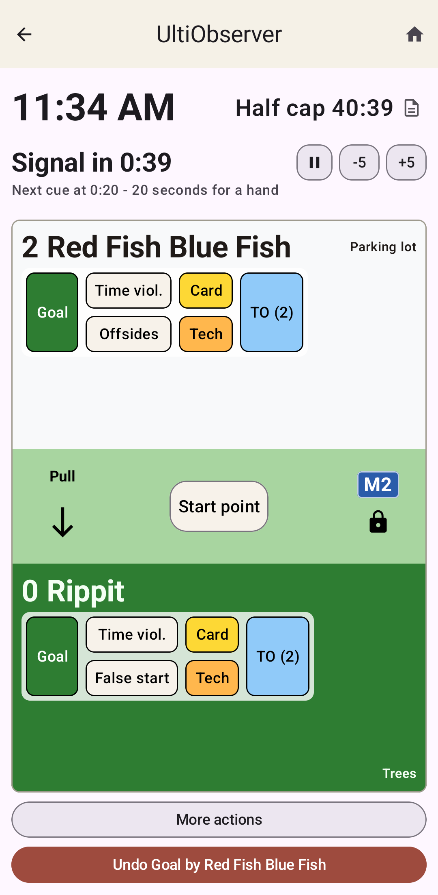
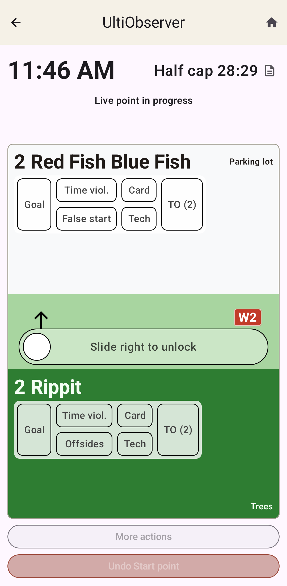

Active Game Screen
==================

This screen is the primary interface during a game from before the first pull
until the game is over. The screen has all the information you may need to access
during the game as well as buttons to record events that happen during the game.

Time and Countdowns
-------------------

      to signal readiness.

The top section of the screen shows the current time, the time until the next
relevant cap, if any, and a countdown for the next game transition, if appropriate.

To the right of the cap, there is a small rules icon, which opens up a quick reference
to the game rules as applied to this game. It shows the target winning and halftime score
(adjusted by caps if appropriate), the times that any enabled caps will happen
(based on the start time and the offsets in the rules), the timeout rules, and
the gender ratio rules for mixed games.

The countdown has a button to pause and restart the countdown if you need to do that.
There are also **+5** and **-5** buttons, which adjust the remaining time by 5 seconds
in either direction, if you want to do so.

If water breaks are enabled in the game rules, a water-drop button appears just to the
left of the pause button. Tapping it adds the specified water-break time to the current
countdown.

Below the countdown, the next timing cue you are responsible for as an observer is given.
E.g. Next cue at 0:20 - 20 seconds for a hand.  This means when the timer reaches 0:20,
you should announce to the offense (presumably at your end of the field if you are
receiving this cue) that they have 20 seconds until they need to signal readiness.
If you are on the pulling team's end, the cues will be related to pulling rather than
signaling readiness.

When the score reaches the halftime target (either the normal one or an early one if the
half cap was applied), UltiObserver starts the halftime countdown and shows a halftime message
so the observer can announce it. It is deferrable (by pressing Not yet) in case the half cap
was applied incorrectly.
After halftime expires, normal ready/pull timing for the second half pull begins automatically.

Field Display
-------------

The active game screen may be displayed in either portrait or landscape mode depending on your
`Settings`.

In portrait mode, the field area is oriented with the two end zones at the top and bottom
of the screen. Whichever end you chose for pull prompts is at the bottom. If you chose both or
neither, the bottom is the end that was initially named Near end.
The names of each end are given on the screen at the upper right and bottom right
of the field area.

In landscape mode, the two end zones are on the left and right sides of the screen, with the
names given at the lower left and lower right corners of the field area.

In either case, each end zone shows which team starts the point in that end zone.
See `Team Areas` below.

If you want to flip the display orientation, use `More actions` and **Flip
field display**. This changes only how the field is drawn. It does not change the pulling team,
pull direction, or pull prompt target.

Team Areas
----------

Each team area is colored whatever color you chose for that team. At the top is the
team name and the current score. If you recorded names for the coach and/or captains,
then a small info icon appears next to the team name. Clicking this opens up a popup
with the names for quick reference.

Below the team names, there are 6 buttons where you can record important events
connected to that team.

Goal
    Records a goal for the team, starting the pull countdown for the next point
    (or starting halftime or ending the game if appropriate).

Time viol.
    Records a time violation if they don't signal readiness or pull in the time required.
    See :ref:`time-violations` for details.

Offsides / False start
    Records the appropriate pull violation for that team according to whether they are
    the pulling or receiving team. See :ref:`pull-violations` for details.

    .. note::

        To record a Majority pull violation, click **Offsides**, and then tap
        **This was a Majority pull violation** on the popup screen.

Card
    Records a yellow, red or blue card assessed against a team. See :ref:`misconduct` for details.

Tech
    Records a technical foul assessed against a team. See :ref:`technical-fouls` for details.

TO
    Records a timeout called by a team. See :ref:`timeouts` for details.

The four buttons for violations and misconduct show the current count for that
event so far in the game. For cards, the count is the total that is relevant for
assessing misconduct penalties, i.e. red cards count as 2. If a team has not accrued any
instances of the given violation or misconduct, the number is omitted for brevity.

The timeout button always shows the number of timeouts available for the team in the current
half.

Central Section
---------------

The central green section shows the pull direction with an arrow indicating which team is
pulling to the other.

There is also a lock icon either on the right side (in portrait mode) or the bottom
(in landscape) of the central section.
Pressing the lock button will lock the screen so you can
put it in your pocket without worrying about misclicks during the point.
It keeps the layout in place but disables normal buttons.
Drag the unlock slider to the right to unlock the screen.
The screen also automatically locks during live points by default.
You can disable this feature in the `Settings` if you want.

For mixed division games, if the gender ratio is specified for a given point, a badge with the
requisite gender ratio will also be shown in the central section next to the lock icon.
Fixed gender-ratio rules show this as ``4M/3W`` or ``4W/3M``. ABBA may show the ratio using one
of these or using the sequence shorthand: ``M1``, ``M2``, ``W1``, or ``W2``.
You can choose between these options in the `Settings`.
If one team is choosing the gender ratio, then that will be indicated in their team area.

The center of the field sometimes shows a button to transition the game to the next phase.
**Start point** indicates that the pull happened, presumably before the countdown finished.
**Continue point** will end a timeout and go back to live play before its countdown finishes.
When defensive countdowns are enabled, **Offense is set** indicates that the offense is set,
which starts the defensive countdown.

Caps
----

The next relevant cap is always shown at the top of the screen to the right of the clock.
When the time for the cap is reached, UltiObserver will emit a sound or vibration (if these
are enabled) letting you know. See :ref:`settings` for how to change the sound or
vibration associated with the three caps.

The cap is not applied immediately. In all cases, the current point is finished first.
If it is between points, the next point is played. After this, a message will pop up
prompting you to apply the cap. You may accept or decline the offer. (E.g. if your clock
disagrees with the tournament horn, you may decide to wait until the following point to apply it.)

Applying the cap will affect when the app thinks halftime should be taken or when the game
should be over.

When a cap can no longer have any tangible effect on the game, it is skipped and the next
cap is shown instead. For instance, in a game to 15, if the score is 6-6, then the half cap
can no longer have any effect. The next score necessarily brings one team to 7 points, so
half would be at 8 regardless. In this case, the app will switch to showing the time until
soft cap instead.

Just to the right of the Cap timer is a small rules icon. Click this to see all the rules
that apply to the current game. This includes all the cap times, the target score for
halftime and ending the game (taking into account any applied caps), the current heat or AQI
level if appropriate, and other rules that were set for this game.

Bottom Buttons
--------------

The bottom of the screen holds some buttons for less common operations.

**More actions** opens a menu with a number of less common actions such as adjustments
to the current game state, setup updates, field-display changes, pull-prompt changes,
accessing the event log, and more.
See :ref:`more-actions-menu` for details.

Most game actions are undoable. The Undo button at the bottom of the screen names the
action it will undo, such as **Undo Goal by Team 1** or **Undo Yellow on #7 of Team 2**.
**Redo** is available as well after an undo action unless a new action is recorded to
replace that history.
