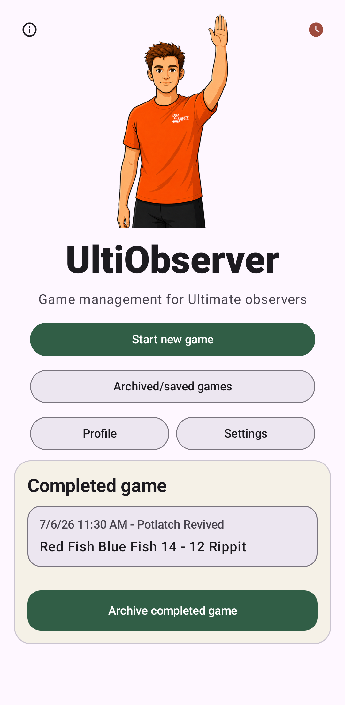

UltiObserver
============

UltiObserver is a game management app for Ultimate observers, which is intended to replace
both the paper score sheet and the stopwatch observers typically use.

Before the game, you can enter all the relevant information about the teams, the tournament,
rules, field orientation, etc. These can be set up in advance and saved as drafts, so everything
is ready when you arrive at the field.

During the game, it helps you track and manage the various events during the game that require
observer attention, including goals, timeouts, pull violations, time caps, and misconduct --
everything that would normally be recorded on a paper score sheet.

It also provides timing cues for pulls, timeouts, misconduct penalties, and halftime,
showing an active countdown with prompts for each time the observer should announce something.
You can choose to have the app emit sounds or vibrations for some or all timing cues
(you control which ones and how they are indicated).

The recommended way to use the timing cues is to use sounds with an earbud in one ear.
The app is mostly quiet, so it won't interfere with your ability to hear during the game, but
that will let you hear the cue sounds without players hearing them. Vibrations are also
effective if your phone is stored in a place where you can notice them. If you keep it in a
loose pocket, it may be difficult to notice the vibrations when moving around.

After recording a goal or timeout, the countdown starts automatically, and you can put your
phone away. Then just listen for the sound or notice the vibration that cues you to announce
the next timing update. For instance, for a pull, when you are at the end zone with the
receiving team, the default sounds are two ticks at 20 seconds left and one tick at 10 seconds,
prompting you to make the corresponding announcements. The specific sound and vibration cues
are all settable, so you can enable whichever ones you find most useful.

After the game, the app will show a game summary page with the final score along with other
details, including all cards that were issued. This page includes a button to share the summary,
so you can quickly send it to the head observer and/or tournament director for the tournament.

What UltiObserver Does
----------------------

UltiObserver tracks the following:

* Information about the game, including: team names, colors, observers, context
  within a tournament, field ends, rules, and starting pull details.
* The current state of an ongoing game, including: orientation of the teams, pull direction,
  gender ratio for mixed games, current score, remaining timeouts available, and how many pull
  violations, cards and technical fouls have been assessed to each team.
* Events that happen during a game, including: goals, timeouts, pull and time violations,
  misconduct on teams or individual players, halftime, and game over;
* Current timing prompts when appropriate including: pulling or receiving a pull, timeout,
  restart after a misconduct penalty, and halftime. The app can optionally use sound or vibration
  for individual cues, as well as for caps coming due.
* Short summaries of the consequences for violations and misconduct with the appropriate restart
  location and whether a check is required.
* Archives for past completed games, setup drafts, and any saved or abandoned in-progress games.
  Event logs and shareable game summaries are available for all past games and the current game.

Current Scope
-------------

UltiObserver is currently only available on Android phones. An iPhone version is
planned, but not yet implemented.
It is so far only targeted at games to a given point total, rather than timed games.
Most of the rules are hard coded to the current USAU rule set, but there are some things
that are settable, including the time between points, timeouts, and halftime.

Contents
--------

.. toctree::
   :maxdepth: 2

   install
   quick-start
   profile
   settings
   setup-game
   game-screen
   ingame-events
   misconduct
   timing-cues
   more-actions
   summary
   archive
   privacy
   troubleshooting
   planned-improvements
   release-notes
