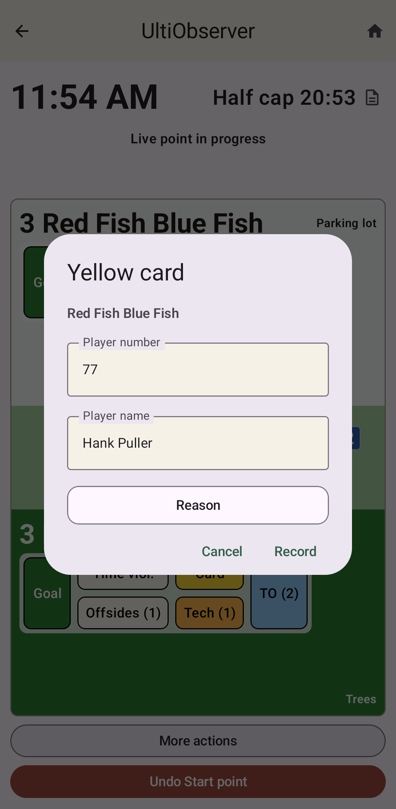
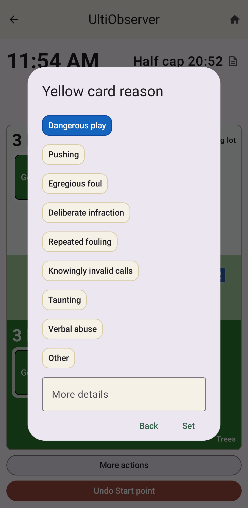
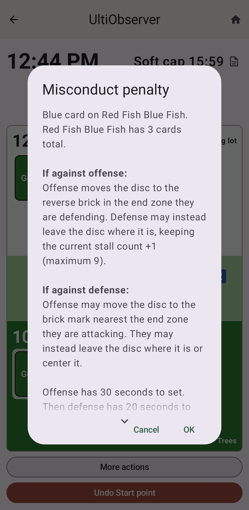

Misconduct
==========

This page provides details about how UltiObserver handles various aspects of misconduct.

Yellow and red cards
--------------------

To record a card (either yellow or red) assessed against a player, click the **Card** button
for that player's team. This will open a popup dialog letting you choose the color of the
card you want to record.

After pressing either yellow or red, you will be prompted to enter the player's information,
including the number and name if you know it. If you only know the number, that's fine.
Or if the player doesn't have a number, you can just enter a name.

You can also select a reason for the card. There are buttons to choose any of the standard
reasons given in the rules. Or you can choose **Other** to enter any reason you want.
There is also a box to enter more details if you want.

Pressing **Record** will close the entry dialog and record the card for that player.

If you enter the number and/or name of a player who already has a yellow card, then it will
inform you that this is the player's second yellow and they are suspended from the rest of
the game.

If you have entered prior cards from previous games at the tournament, and this card brings them
to 3 or more cards total in the tournament (counting reds as 2), it will let you know that
the player is suspended from all games for the rest of the tournament.

If you entered the same number as a previous card holder, but a different name, it will
ask if you really meant to do this, giving you the option to correct the name if you
meant for them to be the same. Since sometimes teams have two players with the same number,
it will allow you to confirm that this is a different person with the same number.

Upon recording the card, a message will tell you the total number of cards assessed against
the team (see :ref:`team-card-totals` below).

If there is a yardage penalty (for the 3rd or later team card) it will tell you what the
consequence is. For live point misconduct, it will ask you whether the card was against
the offense or defense so it can tell you the right restart.

Editing existing cards
----------------------

The **Card** button also lets you edit information about previous yellow or red cards
that were recorded earlier in the game. For instance, you might go back and add names
to players who were only recorded by number or edit the reason for a card when you have
more time to write the relevant details.

You can also access the Edit existing cards screen from the :ref:`more-actions-menu` menu
under **Adjust cards/techs**. This gives you the additional power to delete cards that
you may have erroneously recorded or add cards you forgot to record.

Blue cards
----------

To record a blue card assessed against a team, click the **Card** button and select Blue.
This will directly record a blue card for that team and tell you the current total
number of cards assessed against the team. (See :ref:`team-card-totals` below.)

If there is a yardage penalty (for the 3rd or later team card) it will tell you what the
consequence is. For live point misconduct, it will ask you whether the card was against
the offense or defense so it can tell you the right restart.

.. _technical-fouls:

Technical fouls
---------------

To record a technical foul assessed against a team, click the **Tech** button.
This will directly record a technical foul for that team and tell you the current total
number of technical fouls assessed against the team.

If there is a yardage penalty (for the 3rd or later technical foul) it will tell you what the
consequence is. For live point misconduct, it will ask you whether the tech was against
the offense or defense so it can tell you the right restart.

.. _team-card-totals:

Team Card Totals
----------------

The USAU rules dictate that a blue card is automatically assessed for any yellow card, and two
blue cards are assessed for any red card. I personally find this language confusing, because
it blurs the distinction between actual blue cards and the card totals including yellow and
red cards, which are relevant for misconduct penalties.

UltiObserver does not use this language. Instead we refer to total cards assessed against
a team, counting red cards as 2. I.e. the number of team cards is calculated as blues +
yellows + 2 x reds. This feels more intuitive to me and makes the messaging less confusing.

This team card total is the relevant number for determining misconduct penalties. When the
total is 3 or greater, there are yardage penalties when the misconduct is assessed during
a live point. The app will remind you of the appropriate penalty in these cases.
Since you will probably need to have some discussion with the teams related to the misconduct,
the app waits until you are ready to start the resulting countdown.
Click **Start misconduct countdown** when you are ready.

When the misconduct penalty happens between points, the pull is skipped, and the app will remind
you of the appropriate restart.

Technical fouls have the same misconduct penalties for the third and later technical foul
as for team cards.

Prior Tournament Cards
----------------------

In the setup screen, you may enter cards that were assessed to players on either team in
previous games in the tournament. If a player receives their third total card (counting
reds as 2), then they are suspended from the tournament. The app will prompt you with
this information if such an event occurs.
