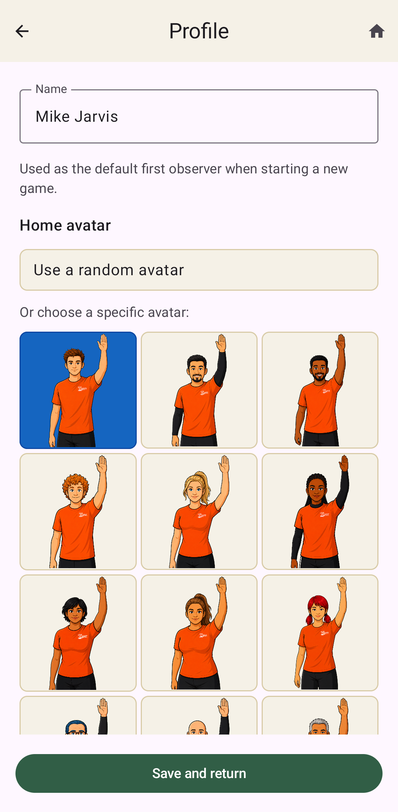

.. _profile-settings:

Profile And Settings
====================

Profile
-------

The main thing to set on the profile screen is your name. When it is set, any new-game setup
pre-populates the first observer row with that name. The second observer row is
left blank for the partner assigned to work with you. You can of course change the first
name as well, but we expect that most of the time you will be one of the two observers
doing the game.

This is also where you can change the avatar picture that displays on the home screen.
The default is to choose randomly from among all the available images, but you may
select one in particular to always show if you want.

Settings
--------

.. figure:: screen-shots/SettingsTop.png
   :class: phone-screenshot
   :target: _images/SettingsTop.png
   :alt: Settings screen with automatic live play, auto-lock, defensive countdown, sound,
      vibration, and volume controls

Settings is where you can change how the app works in various ways.

Automatically start live play when a countdown expires?
    The default behavior when a pull or timeout countdown expires is to automatically have the
    screen move on to the live play screen. If you prefer to do this manually (using either
    the **Start point** or **Continue point** button) then switch this to **No**.

Automatically lock screen when play becomes live?
    The default behavior is to automatically lock the screen when switching to live action.
    That way as you are running around following the action and being an observer, you
    won't accidentally press any buttons in the app. Unlocking is a quick drag action, which
    is pretty quick, but if you prefer not to have it lock automatically, then switch this
    to **No**. Note that there is always a lock icon on the live game screen so you can lock
    the screen manually whenever you need.

Show defense-check countdown after the offense is set?
    We expect that most observers will not need an explicit countdown for the defensive check
    after the offense is ready on timeouts or misconduct penalties. This is commonly handled
    using visible arm chops, rather than a stopwatch. However, if you would prefer to have the
    defense countdown handled by the app, set this option to **Yes**.

Use sounds and vibration for timing cues?
    There are three options here:

    * **Off** completely disables all sound and haptic cues related to any countdowns.
    * **Vibration Only** limits the cues to only use vibration, rather than sounds.
      Any individual cues that are set to use sound will use vibration instead.
    * **Sounds on** enables sounds for all individual cues that are set to use them.
      Probably if you have sounds turned on, you should have an earbud in one ear to hear
      them better and to not broadcast the sound to nearby players.

Also vibrate on cues that use sound?
    If you want your phone to vibrate in addition to using sound whenever a cue has a sound
    setting, set this to **Yes**.

Sound/vibration settings for individual cues
    This opens a sub-page where you can set a sound or vibration to use for each specific
    kind of cue that we have in the game. The defaults are what I think would be a reasonable
    set to use, but you can adjust each cue's sounds or vibration setting to your preference.
    The **x2** and **x3** buttons for each set a repetition for the sound or vibration.
    So you can have a cue use 1, 2 or 3 beeps for instance.

Sound volume
    This sets the sound volume as a fraction of your phone's overall media volume.

Vibration length
    This changes how long the vibration action lasts. There is a **Test** button so you can
    see what the currently set length will feel like.
