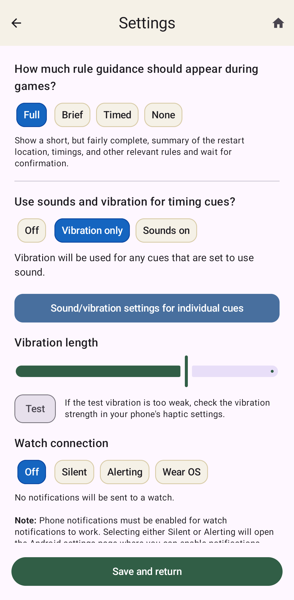

Settings
========

Settings is where you can change how the app works in various ways.

Rule Guidance
^^^^^^^^^^^^^

How much rule guidance should appear during games?
    For many user actions during a game, the default app behavior is to display a confirmation
    or informational message. It also gives a summary of the relevant rules (such as restart
    location, whether there is a required check, etc.) and the resulting game state (e.g.
    timeouts remaining or a team's total card count). For in-point misconduct penalties,
    it also asks whether the misconduct is on the offense or defense, so it can inform you about
    the correct restart. This behavior is called **Full** here.

    For experienced observers, this information is probably not necessary, so we provide
    three less verbose guidance modes:

    * **Brief** just gives a very short reminder of the relevant rule (e.g. '[Team] starts at
      midfield' for a second offsides), and doesn't have the offense/defense question for
      misconduct penalties.
    * **Timed** has the same message as **Brief**, but automatically closes the message after
      5 seconds. This still lets you cancel an action if you need to, but if you ignore it, it
      treats that as though you pressed OK, confirming the action. Other dialogs that require
      input to collect information or correct errors do not time out.
    * **None** doesn't show any confirmation message for most actions. A few required notices
      still appear briefly, including invalid timeout attempts, player suspensions, offsides
      in mixed games (so you can change it to majority pull violation if necessary), and cap and
      water-break prompts. These automatically close after 5 seconds, performing the normal OK
      action for those that requested a confirmation. But most actions just apply directly
      without any message.

Sounds and Vibration
^^^^^^^^^^^^^^^^^^^^

Use sounds and vibration for timing cues?
    There are three options here:

    * **Off** completely disables all sound and haptic cues related to any countdowns.
    * **Vibration only** limits the cues to only use vibration, rather than sounds.
      Any individual cues that are set to use sound will use vibration instead.
    * **Sounds on** enables sounds for all individual cues that are set to use them.
      Probably if you have sounds turned on, you should have an earbud in one ear to hear
      them better and to not broadcast the sound to nearby players.

Also vibrate on cues that use sound?
    If you want your phone to vibrate in addition to using sound whenever a cue has a sound
    setting, set this to **Yes**.

Sound/vibration settings for individual cues
    This opens a sub-page where you can set a sound or vibration to use for each specific
    kind of cue that we have in the game. The defaults are what I think would be a reasonable
    set to use, but you can adjust each cue's sounds or vibration setting to your preference.
    The **x2** and **x3** buttons for each set a repetition for the sound or vibration.
    So you can have a cue use 1, 2 or 3 beeps for instance.

Sound volume
    This sets the sound volume as a fraction of your phone's overall media volume.

Vibration length
    This changes how long the vibration action lasts. There is a **Test** button so you can
    see what the currently set length will feel like.

Active Game Screen Behavior
^^^^^^^^^^^^^^^^^^^^^^^^^^^

How should the active game screen be oriented?
    This controls how the active game screen displays on your phone. As described in
    :ref:`Active Game Screen`, it can display either in portrait mode, with the two teams
    on the top and bottom, or in landscape mode, with the two teams on the left and right.
    There are three options for how this is decided.

    * **Portrait** Use the portrait display pattern, regardless of the phone's physical
      orientation.
    * **Landscape** Use the landscape display pattern, regardless of the phone's physical
      orientation.
    * **Auto-rotate** Follow the phone's physical orientation if possible. If your phone's
      Android settings have auto-rotate enabled, then this will keep the two ends of the field
      in the same physical part of your phone as the phone rotates through all 4 possible
      orientations, including upside down portrait. Open dialogs will automatically re-render
      with the appropriate width based on the orientation.

      If Android auto-rotate is disabled, then each time the active game screen opens,
      it will start in whatever orientation you are holding the phone and keep it
      oriented that way as the phone moves around.

    Other screens besides the active game screen (e.g. setup, game summaries, archives, etc.)
    are always in portrait mode.

Automatically start live play?
    The default behavior when a pull or timeout countdown expires is to automatically advance
    to live play. If you prefer to do this manually (using either the **Start point** or
    **Continue point** button) then switch this to **No**.

Automatically lock screen?
    The default behavior is to automatically lock the screen when switching to live action,
    either after a pull or at the end of an in-point timeout. That way, while you are moving
    with play, you won’t accidentally press buttons in the app. Unlocking is a simple drag
    action, which is pretty quick, but if you prefer not to have it lock automatically, then
    switch this to **No**. Note that there is always a lock icon on the live game screen so you
    can lock the screen manually whenever you need.

Show defense countdowns?
    We expect that most observers will not need an explicit countdown for the defensive check
    after the offense is ready on timeouts or misconduct penalties. This is commonly handled
    using visible arm chops, rather than a stopwatch. However, if you would prefer to have the
    defense countdown handled by the app, set this option to **Yes**.

Gender Ratio Indicator
^^^^^^^^^^^^^^^^^^^^^^

Show ABBA gender ratio as M1/M2/W1/W2?
    The default for mixed games using ABBA is to display the current point's gender ratio using
    these sequence shorthand names, which indicate whether this is the first or second point in
    the sequence with either the 4M/3W ratio (``M1`` and ``M2``, respectively) or the
    4W/3M ratio (``W1`` and ``W2``).  Set this to **No** if you prefer the
    badge to show the full point ratio as either ``4W/3M`` or ``4M/3W``.

Set 4M/3W and 4W/3M indicator colors
    When there is a specific gender ratio for a point, the app will show a small badge indicating
    the prescribed gender ratio. These default to blue and red for 4M/3W and 4W/3M, respectively.
    This setting lets you change these to different colors if you prefer, or set them both to
    black or white if you don't want the color coding.
