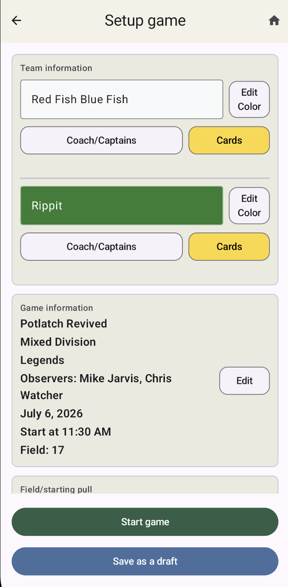
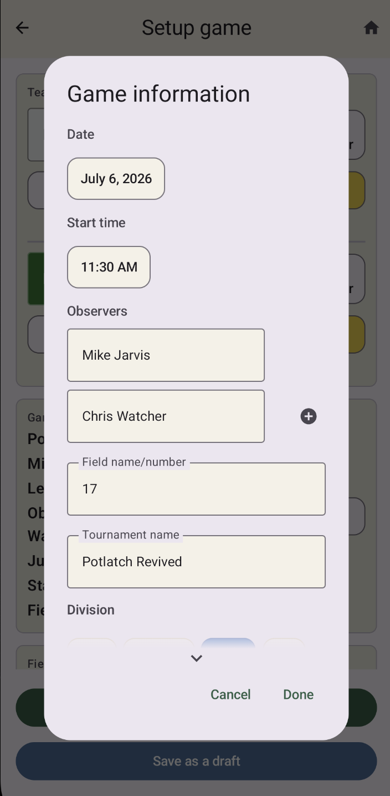
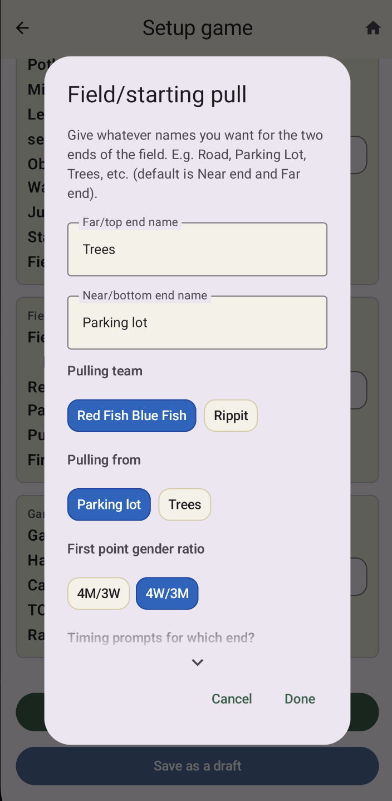
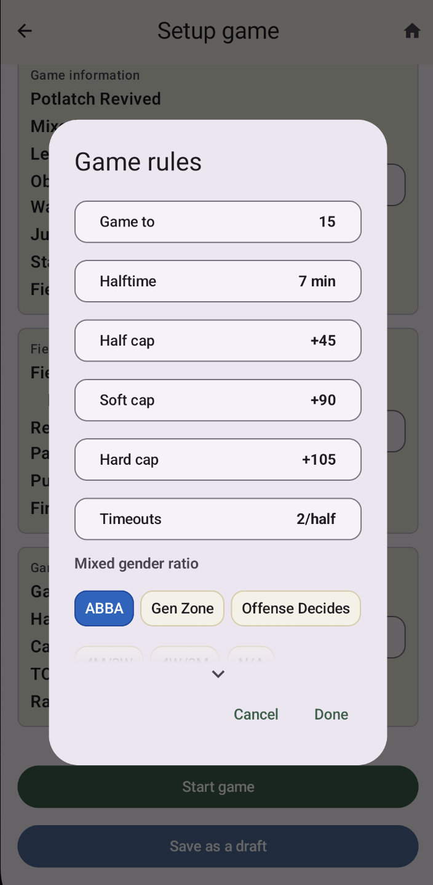

Setting Up A Game
=================

Clicking **Start a new game** takes you to the setup screen.
This is where you enter all the details about the game before the game starts.
Many of these details can be set well in advance of the game, leaving only the details
decided at the pre-game flip to be entered at that time.

You can even enter the details for multiple games in advance, saving them each as drafts
to be reopened when you get to the field. We expect that the usual use pattern will be
to create draft setups for all the games of the day when you get your assignments from the
head observer in the morning each day. Enter the information you know, such as the start
time, field number, who your co-observer(s) will be, the team names, tournament name,
division, level, and any rules that are specific to this tournament. Then click
**Save as a draft**.

When it is time for the game, go to **See archived/saved games** and access the
:ref:`Saved setup drafts` section. All your saved drafts will be listed here. If you entered
a field number, that will be shown in the listing for convenient reference so you know where
to go. Click the game to bring it up for further editing. If you are ready to make this the
current game, click **Make current**. Then you can finish the setup by setting team colors
appropriately and record any details decided at the opening flip. You can also note the
names of the coaches and captains of each team if you want.

When you are done setting the details for your game, **Start game** will take you to the
active game screen.

Team Information
----------------

This section has details about the two teams.

The team names default to **Team 1** and **Team 2**, so you'll obviously want to change these.

You can also set the color you want to use for each team on the live game page by clicking
**Edit colors**. Probably this should roughly match the team's jersey color, but you can use
whatever colors you want here.

The **Coach/captains** button lets you enter names for the coach and captains of each team.
These are available for quick access in a small info icon next to each team name on the
game page.

The yellow **Cards** button lets you enter any cards that have been assessed to players on
each team in previous games. The app will let you know when a player has reached 3 total
cards for the tournament and should be suspended. If your tournament is not using this rule,
you can just skip entering prior cards here.

Game Information
----------------

This is where you can set the basic information about the game being played.

* **Date** This defaults to the current day, so this is likely to be usually correct already.
  To change the date, click on the button showing the date to open the date setting popup.
* **Start time** This defaults to the next half hour, which is convenient if you start the game
  in the app just a little before game time. If you are setting up games well in advance, you'll
  obviously want to change it. Click the button with the time to open the time setting popup.
* **Observers** This defaults to include you if you set your profile name. There will
  initially be one additional entry for your partner. You can add more rows for additional
  observers by clicking the + icon. The - icon will remove a final blank row.
* **Field number** This can be a useful reference, since it displays on the saved drafts listing.
  So if you set up multiple games in the morning, that listing can remind you which field the
  game is happening on.
* **Tournament name** Pretty self-explanatory.
* **Division** Make sure to select **Mixed** here for mixed games to enable mixed-specific rules.
* **Level** If you want, you can set this. E.g. College, club, master, etc.
* **Game context** Optional additional context you might want to record. E.g. finals, semis, etc.

.. note::

    When you start a new setup after a previous game or a previous setup draft, the tournament,
    division, and level will default to the value from that previous game to make it easier to
    set up multiple games in a single tournament.

Field And Starting Pull
-----------------------

The first thing here is what you want to call the two ends of the field. The default
names are simply **Near end** and **Far end** with the assumption that you are located at
**Near end** for the purpose of which pull prompts you get. But you can name them something
more appropriate based on the layout of the field. E.g. Trees, North, Parking Lot, Camera, ...
whatever you want.

The rest of the items are the details that are decided at the opening pull.

* **Pulling team**  Which team starts on defense.
* **Pulling from**  Which end are they pulling from?
* **First point gender ratio**  This option is only available if the division is set to Mixed
  and the rules are set to use ABBA for the gender ratio.
* **End for gen zone in first half** The "gen zone" is the common term for the endzone that
  decides the gender ratio when playing under that rule. This option is only available if the
  division is set to Mixed and the rules are set to use Gen zone for the gender ratio. Note that
  official rules say to switch the gen zone in the second half, but you can switch that in
  the Rules section.
* **Timing prompts for which end?** This would normally be whichever end of the field you are
  going to be located for pulls. Typically, you would just want to receive the pull-related
  timing prompts for your end of the field, but you can also choose neither or both, which
  might be appropriate in 3 or 4 person crews.

Game Rules
----------

This is where you can set the rules that apply to this game in case the tournament has any
modifications from standard USAU rules.

* **Game to** What is the normal winning score?
* **Half time** How long is halftime?
* **Half cap** Is there a half cap? And if so, how long after the start time?
* **Soft cap** Is there a soft cap? And if so, how long after the start time?
* **Hard cap** Is there a hard cap? And if so, how long after the start time?
* **Timeouts** How many time outs does each team have each half, including a possible floater
  (an extra timeout that can be taken in either half)?
* **Mixed gender ratio** What rule should be used to determine the gender ratio each point?
  This option is only available if the division is set to Mixed. Options include:

  * **ABBA** - Alternate two at a time starting after the first point. So if the ratio for
    the first point is M (i.e. 4M/3W), then the pattern will be M W W M M W W M M W W ...
  * **Gen zone** - The team in a particular end zone decides the ratio each point. The official
    rules say to switch the end zone at half time (which is definitely a good idea), but if
    your game is not respecting that rule, you can choose to disable that.
  * **Offense decides** - The team receiving the pull decides the ratio each point. This used
    to be the standard way to choose, but is rarely used these days. Still, it's an option.
  * **4M/3W** - Just use 4 man-matching, 3 woman-matching for the whole game.
  * **4W/3M** - Just use 4 woman-matching, 3 man-matching for the whole game.
  * **N/A** - Don't have the app handle anything related to the gender ratio.

At the bottom, there is a button to **Reset to USAU defaults**, which sets all rules back to
the normal USAU standard rules.
