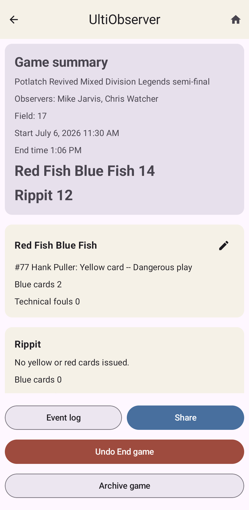
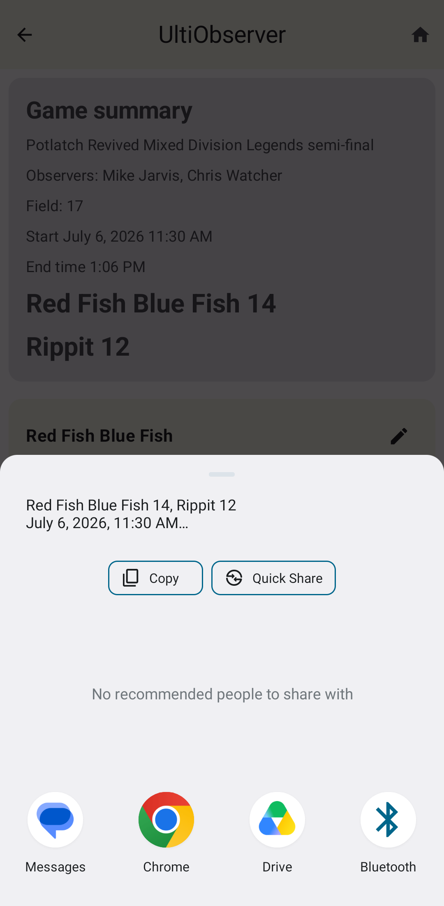
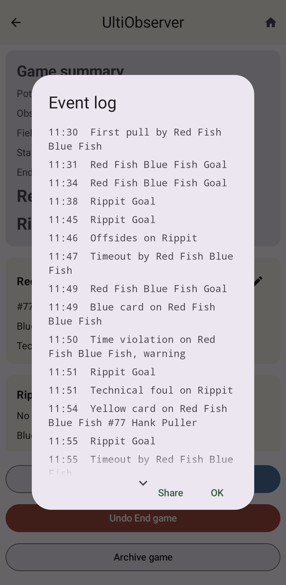

Game Summary
============

      score, and team misconduct totals

After a game is over, the app will show you a post-game summary page with the
most important information about the game including:

* The tournament, division, and level
* Observer names
* Field number
* Start and end times
* Final score
* Per-player yellow and red cards assessed against each team, including reasons if given
* Total blue cards and technical fouls

Any information that was not set for the game is omitted. If a team had no misconduct assessed
against them, that is stated explicitly.

.. _summary-share:

Share
-----

After a game, you will usually need to report this information to the tournament
director and the head observer. The **Share** button makes this easy to do if you
have an email or phone number for them.

The **Share** action uses Android's normal share function. You choose the target,
such as a text message, email, GroupMe, Discord, or whatever communication channel
has been set up to pass along this information after games.

Shared summaries are intentionally compact. They include just the information given
on the summary page. They do not include things like pull violations, timeouts, or
other events that are no longer relevant after the game is over.

Event Log
---------

The event log records all game events with timestamps, including first pull, goals,
cards, technical fouls, pull violations, time violations, timeouts, halftime,
game over, and any manual adjustments that were performed.

Use the event log when you need to reconstruct when something happened or explain a
correction to a tournament director or head observer.

The event log can also be shared through the same Android share function.
