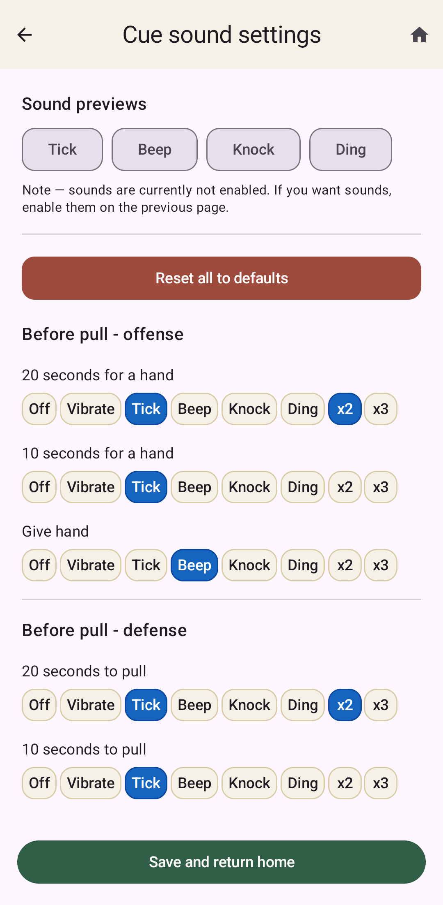
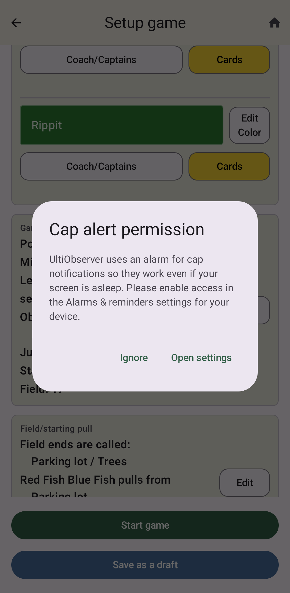

Timing Cues
===========

One of the main jobs of observers is to keep track of the time limits for different
intervals during the game. For each of these, UltiObserver starts a countdown showing
how much time is left until something is supposed to happen (offense ready, pull,
offense set, etc.).

In addition, there are standard timing cues that observers are expected to say at various
points before the end of the countdown. UltiObserver lists these just below the countdown
to remind you.

As additional help, you can also set the app to give vibrations or short sounds at the cue times.
See :ref:`settings` for details about how to do this.

Time between points
-------------------

Between points, the live screen shows the countdown that is relevant for whichever end zone
you are getting prompts for. Typically you set it to provide the countdown for the team
in the end zone where you are positioned between points, but you can also configure it to
give both sets of prompts or neither. In these cases, the countdown is still shown, but
you either get the cues for both teams or neither team.

For offense countdowns, the cues that are displayed are:

.. list-table::
   :class: cue-table
   :header-rows: 1
   :widths: 1 3

   * - Time
     - Cue
   * - 0:20
     - 20 seconds for a hand
   * - 0:10
     - 10 seconds for a hand
   * - 0:00
     - Give hand

If the team hasn't signaled readiness by 0:00, you may choose to issue a time violation.
See :ref:`time-violations`. The typical thing to do at 0:00 is to raise your hand to signal
that the team is ready and let them know that you are doing so.

For defense countdowns, the cues that are displayed are:

.. list-table::
   :class: cue-table
   :header-rows: 1
   :widths: 1 3

   * - Time
     - Cue
   * - 0:20
     - 20 seconds to pull
   * - 0:10
     - 10 seconds to pull
   * - 0:00
     - Time violation?

If the team hasn't pulled by 0:00, you may choose to issue a time violation.
See :ref:`time-violations`.

During a between points countdown, you may always choose to start the point early if that
is appropriate by clicking **Start point** in the center of the game screen.

Timeout Timing
--------------

When a timeout is called between points, the configured timeout duration is added to the
regular between-points countdown. There is not much change to the cue schedule other than
adding cues for 1 minute for a hand or 1 minute to pull as appropriate.

Timeouts during a live point start a timeout countdown, which ends when the offense is
meant to be set. The timing cues for this countdown are:

.. list-table::
   :class: cue-table
   :header-rows: 1
   :widths: 1 3

   * - Time
     - Cue
   * - 0:30
     - Sideline players clear the field
   * - 0:20
     - 20 seconds offense
   * - 0:10
     - 10 seconds offense
   * - 0:05
     - Countdown from 5
   * - 0:00
     - Offense freeze

If you have defensive check countdowns enabled (see :ref:`settings`), then this will transition
into a countdown for the defense to check the disc in.  The cues for this are:

.. list-table::
   :class: cue-table
   :header-rows: 1
   :widths: 1 3

   * - Time
     - Cue
   * - 0:20
     - 20 seconds defense
   * - 0:10
     - 10 seconds defense
   * - 0:00
     - Offense start when ready

Halftime Timing
---------------

When halftime starts, a halftime countdown begins showing how much time is left in the half.
There are two cues for this:

.. list-table::
   :class: cue-table
   :header-rows: 1
   :widths: 1 3

   * - Time
     - Cue
   * - 5:00
     - 5 minutes
   * - 2:00
     - 2 minutes

When this countdown hits 0:00, it automatically transitions into the regular countdown for
the first pull of the second half.

Cap Alerts
----------

Half, soft, and hard caps don't have any cues for something to shout at any time, but you
can set them to vibrate or make a sound when they come due. These are set in the same place
as the other cue vibrations/sounds (cf. :ref:`settings`).

The cap alerts use the phone's alarm mechanism. On most systems, this means you will need to
explicitly allow UltiObserver to set alarms on your device. When starting a game that has
caps enabled (and if the settings are such that they should make sounds or vibrate), the
app checks to see if your phone allows it. If not, it will prompt you to go to the relevant
setting screen on your phone to allow UltiObserver to set alarms and reminders. Simply
slide the setting to the right to allow.

If you don't want to allow UltiObserver to do this for whatever reason, you should set the
cap actions to None in the Settings, and it will not prompt you to enable this anymore.
