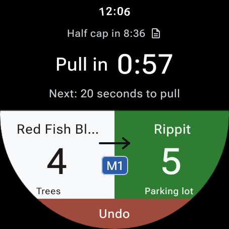
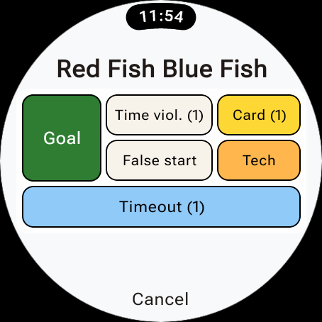
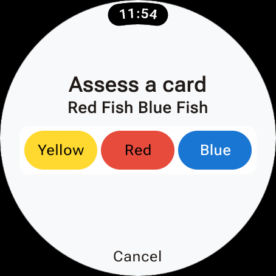

Wear OS Companion App
=====================

If you have a Wear OS smart watch, you can install the UltiObserver companion app.
This makes the user experience a whole lot nicer, honestly. You still do all the
setup stuff on the phone for each game. But once the game starts, you can usually
leave the phone in your pocket for the duration of the game.
All of the essential game controls can be handled on the watch.

The primary exception is entering the player name and reason for yellow and red cards.
See `Team Action Screen` below for details.
Also, anything that requires the `More actions` menu can only be done on the phone.

You can use the phone and watch interchangeably during a game. If it's ever more convenient
to use the phone, go ahead and do that. When the phone is stashed away, you can use the
watch.

Getting Connected
-----------------

Install UltiObserver on both your phone and your paired Wear OS watch.
(See `Installing on a Wear OS Watch`.)
In UltiObserver's `Settings` on the phone, set **Watch connection** to **Wear OS**,
then open UltiObserver on the watch.

Before starting a game, the watch will show the message "No active game".
You should use the phone to do all the setup for the game. Once you click **Start game**,
the watch will show the teams and score, along with a countdown for the first pull.

The phone should remain on the active game screen during the game. If you leave the game screen,
the watch will disable the controls and ask you to resume the current game on the phone.
Once you do so, the watch controls will be enabled again.

The phone always holds the definitive game state, so if the watch loses connection with the
phone, actions will be disabled on the watch. It may show the last score it knew about,
but you won't be able to record new actions until the connection is re-established.
You can use the phone in the meanwhile, until you figure out
whatever is going wrong with the connection (See `Watch Troubleshooting` below).
Once it reconnects, the watch will update to the current game state.

Main Watch Screen
-----------------

The top half of the screen shows all the relevant time information for the game.
The clock at the top is the official game clock, including any adjustment you made on
the phone.
Underneath that is the time to the next relevant cap. This row also has the rules icon.
Clicking that (or technically anywhere in that row) will open the rules reference page,
just like on the phone.

Below that is the current countdown and next timing cue. If no countdown is currently
active, this area will show some message indicating the current state of the game,
such as "Live point in progress". Other messages show up here when relevant.

The two colored team areas cover most of the bottom half of the screen.
These show the team names, the current score, and which end of the field they are on.
See the **Team display on watch** setting in `Wear OS Settings` to control whether
the teams stay fixed throughout the game or the ends do.

An arrow in the middle indicates the pull direction.
For mixed games, a badge shows the ABBA gender ratio or indicates which team chooses the ratio,
depending on the game's rules.

At the bottom of the screen there is an **Undo** button, just like on the phone,
which will undo the most recent action. After pressing **Undo**, a **Redo** button
will appear, sharing the space at the bottom.
To prevent accidentally messing up your game state, both of these buttons require a long press
to activate. Just hold the button down for about a second. On most watches, there will be
a slight vibration when the press activates. If you want this protection for all of the
main screen buttons, enable **Require long presses** in `Wear OS Settings`.

Team Action Screen
------------------

If you tap either team area from the main screen, it will take you to a screen with
actions related to that team.

The main section of this screen includes the six team action buttons, which work mostly
the same as the corresponding buttons on the phone:

* **Goal** records a goal
* **Time viol.** records a time violation
* **Offsides** or **False start** records the corresponding pull violation. (For Majority pull violations, use **Offsides** and then click **This is a Majority pull violation**.)
* **Card** records yellow, red and blue cards.
* **Tech** records technical fouls.
* **Timeout** records a timeout.

See `In-Game Events` and `Misconduct` for details about these actions.

The only one that works differently from the phone version is the **Card** button for
yellow or red cards.
The watch will let you record the number for the player getting the card, but not
their name or the reason for the card.
It gives you an option to enter these details on the phone if you want.
Or you can record the card directly without the additional information yet.
You can always go back later on the phone to add more details when it may be more
convenient to pull out your phone (e.g. after the point is over).
See `Editing existing cards`.

If you choose to **Enter details on phone**, the watch will transfer control to the phone,
sending it the number you entered on the watch (if any). While the phone has control,
the watch will display "Continue on phone" until you complete the action on the phone.
If you want to cancel that and return control to the watch, you can press **Cancel**,
which will let you record the card from the watch with only the number.

Confirmations and rule guidance use the same text as the phone according to the
**Rule Guidance** setting. You can scroll long messages on the watch when necessary.
**Timed** and **None** also work the same as on the phone,
including automatically accepting or confirming most notifications.

If coach and/or captain names were entered for the team during setup, there will be a small
information icon (a circled "i") after the team name above the action buttons.
Tapping the icon will show a screen with their names for reference.

Countdown Controls
------------------

From the main watch screen, if you tap the countdown area, it will open up the countdown
controls on the bottom of the screen. 

You can pause or resume the timer, add or subtract 5 seconds, or start a water break when
the game's rules allow it.
When appropriate, this panel also offers **Start point**, **Continue point**, or
**Offense is set**, just as on the phone. Tap the countdown again or **Back** to return
to the main screen.

Watch Timing Alerts
-------------------

The watch will (by default) be the device for all timing cues that use vibration.
They work even when the watch screen is off or another app is open.
If the watch cannot receive a vibration, the phone vibrates instead.
Sounds cues play on the phone or its connected earbud regardless.
If you prefer to keep vibrations on your phone, you can change the setting
**Vibrate on watch?** to No.

Note that the choice of sound or vibration is still set individually for each timing cue.
Enabling watch vibration or not doesn't change anything about those choices.
See `Timing Cues` and `Sounds and Vibration`.

Notification Permission
-----------------------

If the watch asks for notification permission, allowing it provides a **Return to game**
shortcut from your watch's home screen when there is a current game.
It looks like a small version of the UltiObserver icon at the bottom of the screen.
This makes it easier to reopen UltiObserver when a game is in progress if you
had to leave the game screen to do something else on your watch.

Declining this permission does not prevent game controls or timing vibrations.
It just means you would have to open the app again the normal way if you navigate away from it.

Watch Troubleshooting
---------------------

The watch cannot find the phone
~~~~~~~~~~~~~~~~~~~~~~~~~~~~~~~~

If the watch says **Could not find a paired phone running UltiObserver**, or does not
get past **Connecting…**, try these steps:

1. Open your watch's companion app on the phone (for example, the Google Pixel Watch
   app) and check that it shows the watch as connected. Installing UltiObserver on
   both devices does not pair them; complete the watch's normal setup first.
2. Keep the phone and watch near each other, with Bluetooth enabled and airplane mode
   off on both devices. Make sure the normal watch companion app is able to connect.
3. Check the companion app's permissions in the phone's Android settings. In particular,
   the Google Pixel Watch app needs **Nearby devices** permission. This is a permission
   for the companion app, not for UltiObserver. Google's
   `Pixel Watch connection help <https://support.google.com/googlepixelwatch/answer/13579198>`_
   has more device-specific instructions; for other watches, consult the manufacturer's help.
4. Open UltiObserver on the phone and check that **Watch connection** is set to **Wear OS**
   in `Settings`. Then open UltiObserver on the watch and tap **Retry** if it is shown.
5. Check for UltiObserver updates in the Play Store on both devices. The phone and watch
   apps are installed and updated separately, so check both whenever you update either one.
6. If it still will not connect, restart the phone and watch, open UltiObserver on the
   phone first, then open it on the watch and try again.

The watch asks me to update UltiObserver
~~~~~~~~~~~~~~~~~~~~~~~~~~~~~~~~~~~~~~~~

The version updates on the phone and the watch are separate processes. Updating one does
not automatically update the other. So if you have updated the version of UltiObserver
on one of the two devices, the software may be incompatible with the other one.
In this case, the connection handshake will notice the incompatibility and tell you
to update the one that still has the older version.

Once you have updated the software, you can reopen the app and tap **Retry** on the
watch to restart the connection handshake.

The watch says "No active game"
~~~~~~~~~~~~~~~~~~~~~~~~~~~~~~~~

This means the watch has reached UltiObserver on the phone, but there is no current game
to display. You need to start a game on the phone before the watch will have anything
useful to display. After clicking **Start game** from the setup screen, the watch should
show the game.

The score is visible, but the controls do not work
~~~~~~~~~~~~~~~~~~~~~~~~~~~~~~~~~~~~~~~~~~~~~~~~~~~

Check the message in the countdown area. **Lost connection** means the watch cannot
currently send actions to the phone. Check that the phone is nearby and connected,
then tap **Retry** on the watch. If it still fails, work through the connection checks above.
The last score may remain visible while disconnected, so check the phone before repeating
an action whose result you are unsure about.

If the watch instead says **Resume current game on phone to enable actions**, this means
the phone is not showing the active game screen. You need to return to that screen on the
phone for the watch actions to work. Once you have done so, it's ok to lock the phone
screen and put the phone away, but it has to be on that screen, not the home screen,
the settings, or anywhere else.

If everything looks connected but a tap does nothing, check if you have
**Require long presses** set in the `Wear OS Settings`.
When that setting is enabled, you have to hold the press for about a second for it
to register.  **Undo** and **Redo** always require a long press.

The watch does not vibrate
~~~~~~~~~~~~~~~~~~~~~~~~~~~

On the phone, check that **Vibrate on watch?** is enabled in `Wear OS Settings` and that
the particular cue has vibration selected in `Timing Cues`. For cues that use sound,
you can enable **Also vibrate on cues that use sound?** in `Sounds and Vibration`.
Sounds still play through the phone or its connected earbud.

If the phone vibrates instead, the watch may have been unreachable when the cue was sent.
Check the connection and use the **Test** button below **Vibration length** in the
phone's `Sounds and Vibration` settings.

The return-to-game shortcut is missing
~~~~~~~~~~~~~~~~~~~~~~~~~~~~~~~~~~~~~~~~

Check that notifications are allowed for UltiObserver in the watch's system settings,
then reopen UltiObserver on the watch. The shortcut is only present while there is a
current game. If the shortcut isn't present, you can always reopen the app from the
watch's app list instead.

Still having trouble?
~~~~~~~~~~~~~~~~~~~~~

You can continue recording game actions on the phone while troubleshooting the watch.
For an UltiObserver problem, see `Reporting Bugs`. Include both device models, their
Android/Wear OS versions, the UltiObserver version on each device, the exact message
shown on the watch, and whether the manufacturer's companion app shows a connection.
Mention whether it has never connected or stopped working during a game.
